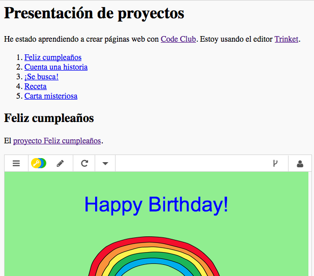
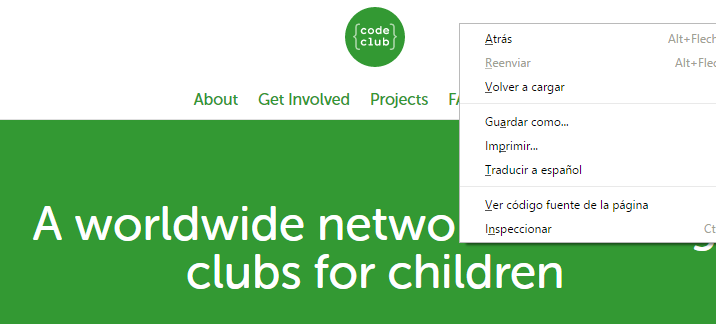
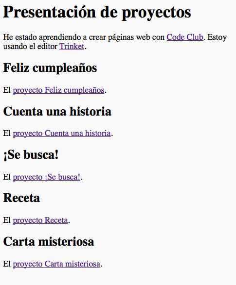
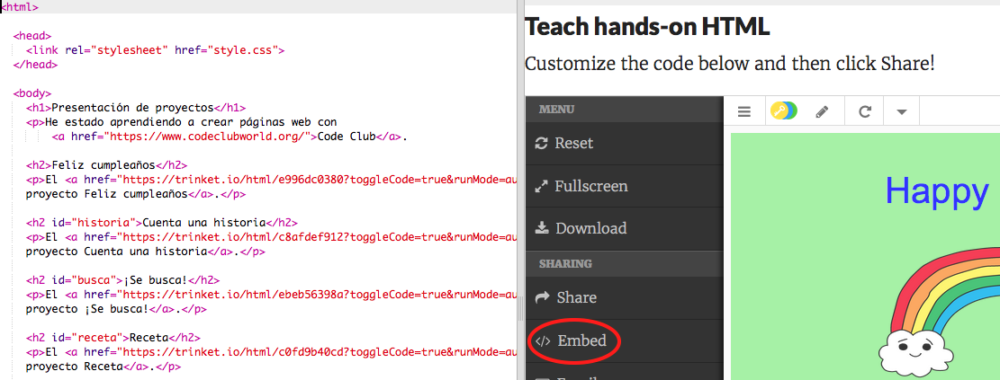
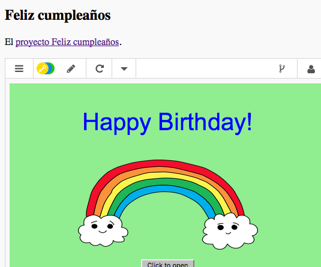

# Introducción {.activity}

En este proyecto, vas a crear una presentación de tus proyectos de HTML y vas a aprender cosas sobre enlaces e incrustación de recursos. 

# Paso 1: Añadir enlaces a páginas web {.activity}

Los enlaces de texto te permiten hacer clic en palabras que te llevan a otras páginas web. Normalmente están subrayados.

## Lista de tareas de la actividad { .check}

+ Abre este trinket: <a href="https://trinket.io/html/9ad31460f0">https://trinket.io/html/9ad31460f0</a>. Si estás leyendo este proyecto en línea, eso es un enlace. También puedes usar el trinket incrustado que verás a continuación. 

  <iframe src="https://trinket.io/embed/html/9ad31460f0" width="100%" height="400" frameborder="0" marginwidth="0" marginheight="0" allowfullscreen>
  </iframe>

+ HTML utiliza la etiqueta `<a>` para los enlaces. 

+ Encuentra la etiqueta `<a>` en tu proyecto. 

+ Añade la dirección de la página web de Code Club <a href="https://www.codeclubworld.org">`https://www.codeclubworld.org`</a> y el texto del enlace:

+ Haz clic en "Run" (ejecutar) para probar tu trinket.

+ Haz clic en el enlace de Code Club para probar la página web. Tu trinket mostrará la página de Code Club: 	

+ Para volver a tu página web tienes varias opciones: 

	+ Ejecuta tu trinket otra vez,

	+ Pulsa la tecla de Retroceso (Backspace) en el teclado, o

	+ Haz clic en el botón derecho del ratón y selecciona Atrás. 

## Lista de tareas de la actividad { .check}

+ Ahora incluye el enlace en una frase dentro de un párrafo:

Prueba tu página web. 

## Desafío: Añade otro enlace {.challenge}

Añade una frase que contenga un enlace a una página web que hayas usado para crear los proyectos. Por ejemplo: <a href="https://trinket.io">https://trinket.io</a> o <a href="http://colours.neilorangepeel.com">http://colours.neilorangepeel.com</a>.

# Guarda tu proyecto {.activity}

# Paso 2: Enlace a un trinket {.activity}

Puedes enlazar la página web con un trinket. 

## Lista de tareas de la actividad { .check}

+ ¿Has guardado el enlace de tu trinket Feliz cumpleaños? Si lo tienes, abre ese trinket en otra pestaña o ventana del navegador. Si no lo tienes, usa de ejemplo este trinket que ya está acabado: <a href="https://trinket.io/html/e996dc0380">https://trinket.io/html/e996dc0380</a>

+ Haz clic en el menú Share (compartir) que hay en la parte superior de la pantalla, y selecciona Link (enlace):

Si has abierto el trinket desde tu cuenta, entonces busca la opción Share que se encuentra debajo de tu trinket:

+ Selecciona la opción 'Only show code or result (let users toggle between them)', que significa: "Sólo muestra código o resultado (permitir que los usuarios alternen entre los dos), y copia el enlace del trinket. 

+ Vuelve al trinket Presentación de proyectos y añade un encabezado `<h2>` y un enlace a tu proyecto Feliz cumpleaños.

Prueba tu página web. Debería de parecerse a esta:

Haz clic en el enlace de Feliz cumpleaños para comprobar que te lleve al trinket.

## Guarda tu proyecto {.save}

## Desafío: Crea una lista de tus proyectos {.challenge}

Añade algún otro proyecto de HTML y CSS que hayas creado en Code Club. Usa encabezados `<h2>` para organizar tu página web. 

Si no tienes los enlaces de los proyectos que has creado, puedes usar los ejemplos de Code Club:

+ Feliz cumpleaños: <a href="https://trinket.io/html/e996dc0380">https://trinket.io/html/e996dc0380</a>

+ Cuenta una historia: <a href="https://trinket.io/html/c8afdef912">https://trinket.io/html/c8afdef912</a>

+ ¡Se busca!: <a href="https://trinket.io/html/ebeb56398a">https://trinket.io/html/ebeb56398a</a>

+ Receta: <a href="https://trinket.io/html/c0fd9b40cd">https://trinket.io/html/c0fd9b40cd</a>

+ Carta misteriosa: <a href="https://trinket.io/html/1d4d4c5ce1">https://trinket.io/html/1d4d4c5ce1</a>

Tu página acabada debería de parecerse a esta:

## Guarda tu proyecto {.save}

# Paso 3: Incrustar proyectos {.activity}

Además de enlazar los trinkets como páginas web, también podemos incrustarlos dentro de una página web.

## Lista de tareas de la actividad { .check}

+ Es posible que prefieras trabajar en modo de pantalla completa para tener más espacio:

Presiona la tecla Esc (Escape) para salir del modo de pantalla completa.

+ Ejecuta tu trinket y haz clic en el enlace de Feliz cumpleaños. 

+ Haz clic en el menú de trinket y selecciona __Embed__ (incrustar). Si no estás en modo de pantalla completa, es posible que tengas que desplazarte hacia abajo. Usa la barra de desplazamiento de la derecha o la flecha hacia abajo del teclado.

## Lista de tareas de la actividad { .check}

+ Selecciona 'Only show code or result (let users toggle between them)', que significa "Sólo muestra código o resultado (permitir que los usuarios alternen entre los dos) y __copia__ el código incrustado para el trinket. 

+ Trinket ha creado un HTML para que lo incluyas en tu página web. Este usa una etiqueta `<iframe>` que permite incrustar contenido dentro de una página. 

+ A continuación pega el código debajo del enlace que lleva al trinket de Feliz cumpleaños:

+ Ejecuta tu trinket para probarlo. Deberías ver tu proyecto Feliz cumpleaños incrustado en la página web. 

+ Es posible que la parte inferior de tu trinket no se vea. Puedes arreglarlo cambiando el valor de la altura (height) en la etiqueta `<iframe>`. 

Fija la altura a __400__. Si hiciste cambios en el proyecto Feliz cumpleaños, es posible que tengas que escoger un valor diferente. 

## Guarda tu proyecto {.save}

## Desafío: Incrusta más proyectos {.challenge}

Incrusta algún proyecto más en la presentación. Recuerda que puedes encontrar fácilmente las páginas de trinket si haces clic en los enlaces de tu página web. 

# Paso 4: Crea un índice de contenidos {.activity}

Vamos a crear un índice de contenidos para que podamos acceder fácilmente a todos los proyectos. 

## Lista de tareas de la actividad { .check}

+ Además de crear enlaces a otras páginas web, también podemos crear enlaces a partes de una página web si indicamos un id. 

Añade un id al encabezado `<h2>` del proyecto Feliz cumpleaños:

+ Añade ids a todos los proyectos y asígnales nombres cortos: historia, busca, receta y carta. 

+ Puedes crear un enlace a un elemento con un id si insertas el símbolo de la almohadilla ‘#’ delante de su nombre. Por ejemplo,  `#cumpleaños`. 

Crea una lista ordenada de los enlaces a tus proyectos. (Las listas ordenadas se explican en el proyecto Receta.)

+ Ejecuta tu proyecto y pruébalo haciendo clic en los enlaces para moverte por tus proyectos. 

## Guarda tu proyecto {.save}

# Paso 5: Volver al principio {.activity}

## Lista de tareas de la actividad { .check}

+ También es práctico poder volver al principio de la página. HTML tiene `#top` (Arriba) para poder hacerlo. 

+ Añade un enlace a `#top` después de cada proyecto incrustado en tu página web:

+ Prueba tus enlaces haciendo clic en Arriba para volver al principio de la página. 

## Guarda tu proyecto {.save}

## Desafío: Mejora tu presentación {.challenge}

Usa el CSS que has aprendido para hacer que tu página sea más interesante. Intenta cambiar el color de fondo de la página o el tipo de fuente de los encabezados. 

También puedes añadir algo de información sobre los proyectos y explicar qué te gustó más cuando los hiciste. 

## Desafío: Crea una nueva presentación {.challenge}

Trinkets no es lo único que se puede incrustar en una página web. Puedes incrustar vídeos, aplicaciones (como una aplicación meteorológica) o proyectos de Scratch. 

Abre este trinket incrustado de Scratch de ejemplo y ejecútalo: <a href="https://trinket.io/html/9f7212b8fe">https://trinket.io/html/9f7212b8fe</a>

Ve a la página web de Scratch y busca un proyecto que te guste. Puede ser un proyecto tuyo u otro que hayas encontrado.

Si has entrado a tu sesión, puedes hacer clic en el botón 'Embebido' que está debajo del proyecto para ver el código HTML y poder incrustarlo. 

Si no has entrado a tu sesión, busca el número de proyecto de Scratch en la dirección de Internet. 

Haz una copia del código `<iframe>` en el ejemplo incrustado de Scratch y cambia el número del proyecto por el del proyecto que quieres incrustar :

## Guarda tu proyecto {.save}

## Community Contributed Translation { .challenge .pdf-hidden }

This project was translated by Montse Verdaguer. Our amazing translation volunteers help us give children around the world the chance to learn to code.  You can help us reach more children by translating a Code Club project via [Github](https://github.com/CodeClub/curriculum_documentation/blob/master/contributing.md) or by getting in touch with us at hello@codeclubworld.
