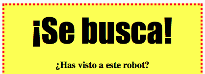

# Introducción { .intro}

En este proyecto aprenderás a hacer tu propio póster.


# Paso 1: Dar estilo a tu póster { .activity}

Empezaremos por editar el código CSS del póster.

## Lista de tareas de la actividad { .check}

+ Abre este trinket: <a href="http://jumpto.cc/web-wanted" target="_blank">jumpto.cc/web-wanted</a>. Si estás leyendo este proyecto online, también puedes usar la versión incrustada de este trinket que encontrarás a continuación.

<div class="trinket">
	<iframe src="https://trinket.io/embed/html/58318bee1f" width="100%" height="550" frameborder="0" marginwidth="0" marginheight="0" allowfullscreen>
	</iframe>
</div>

+ Haz clic en la pestaña "style.css". Verás que ya hay propiedades CSS para el `div` que contiene las diferentes partes del póster.

	```
	div {
		text-align: center;
	    overflow: hidden;
	    border: 2px solid black;
	    width: 300px;
    }	
	```

+ Empezaremos por cambiar la propiedad `text-align` (alineación del texto):

	```
	text-align: center;
	```
	
	¿Qué pasa si cambias la palabra `center` (centro) por `left` (izquierda) o por `right` (derecha)?

+ ¿Y la propiedad `border` (borde)?

	```
	border: 2px solid black;
	```

	`2px` en el código de arriba significa 2 píxeles. ¿Qué ocurre cuando cambias `2px solid black` (2px negro sólido) por `4px dotted red` (4px rojo punteado)?

+ Cambia el `width` (ancho) del póster a `400px`. ¿Qué le ocurre al póster?

+ Vamos a añadir algo de CSS para establecer el color de fondo del póster. Ve al final de la línea 5 del código y presiona la tecla de retorno, para que aparezca una nueva línea en blanco.

	

	Escribe el siguiente código en la nueva línea en blanco:

	```
	background: yellow;
	```

	Asegúrate de escribir el código _exactamente_ igual que arriba. Te habrás dado cuenta de que ahora el fondo del `<div>` es amarillo.

	

##Reto: Mejorar tu póster {.challenge}
Añade la siguiente propiedad de CSS al estilo de tu `div`:

```
border-radius: 40px;
```

¿Qué hace esta propiedad? ¿Qué sucede si cambias el número en el código de arriba?.

## Guarda tu proyecto {.save}

# Paso 2: Dar estilo a las imágenes { .activity}

Vamos a mejorar el estilo de la imagen del póster.

## Lista de tareas de la actividad { .check}

+ Ahora mismo, no hay ninguna propiedad de CSS para la etiqueta ``, así que ¡vamos a añadir algunas!

	En primer lugar, añade el siguiente código por debajo del CSS para tu div:

	```
	img {

	}
	```

	

+ Ahora podemos añadir a las imágenes propiedades de CSS entre las llaves `{` y `}`.

	Por ejemplo, añade este código entre las llaves para establecer el ancho ("width") de la imagen:

	```
	width: 100px;
	```

	Verás que el ancho de la imagen cambia, para que sea de 100 píxeles.

	

+ También puedes añadir un borde alrededor de la imagen con este código:

	```
	border: 1px solid black;
	```

+ ¿Te has dado cuenta de que no hay demasiado espacio entre la imagen y el borde?

	

	Puedes arreglar esto añadiendo un poco de relleno alrededor de la imagen:

	```
	padding: 10px;
	```

	Padding (relleno) es el espacio entre el contenido (en este caso una imagen) y su borde.

	

	¿Qué crees que pasaría si cambiases el relleno a `50px`?

##Reto: Mejorar tu imagen {.challenge}
¿Puedes dar a tu imagen un color de fondo? ¿O un borde redondeado?

## Guarda tu proyecto {.save}

# Paso 3: Dar estilo a los encabezados { .activity .new-page }

Vamos a mejorar el estilo del encabezado `<h1>`.

## Lista de tareas de la actividad { .check}

+ Añade el siguiente código por debajo del CSS de tu imagen:

	```
	h1 {

	}
	```

	Aquí es donde añadirás las propiedades de CSS para tu encabezado principal `<h1>`.

+ Para cambiar la fuente de tus encabezados `<h1>`, añade el siguiente código entre las llaves:

	```
	font-family: Impact;
	```

+ También puedes cambiar el tamaño del encabezado:

	```
	font-size: 50pt;
	```

+ 	¿Te has dado cuenta de que hay mucho espacio entre el encabezado `<h1>` y el resto de los elementos a su alrededor?

	

	Esto sucede porque hay un margen alrededor del encabezado. El margen es el espacio entre el elemento (en este caso el encabezado) y el resto de cosas a su alrededor.

	Puedes reducir el margen con este código:

	```
	margin: 10px;
	```

	

+ También puedes subrayar el encabezado:

	```
	text-decoration: underline;
	```

##Reto: ¡Haz que tu póster sea impresionante! {.challenge}
Añade más código CSS para dar estilo a los encabezados `<h3>` y a los párrafos. 


Aquí tienes una lista con algunas de las propiedades de CSS que puedes usar:

```
color: black; (color: negro)
background: white; (fondo: blanco)
font-family: Arial / Comic Sans MS / Courier / Impact / Tahoma; (tipo de letra)
font-size: 12pt; (tamaño de la fuente)
font-weight: bold; (grosor de letra: negrita)
text-decoration: underline overline line-through; (decoración del texto: subrayar, línea por encima, tachado)
margin: 10px; (margen)
padding: 10px; (relleno)
width: 100px; (ancho)
height: 100px; (alto)
```

## Guarda tu proyecto {.save}

##Reto: ¡Anuncia un evento! {.challenge}
¿Puedes hacer un póster para un evento que se celebre en tu escuela? Podría ser una obra, un evento deportivo, o incluso un póster para anunciar tu Code Club!

## Guarda tu proyecto {.save}